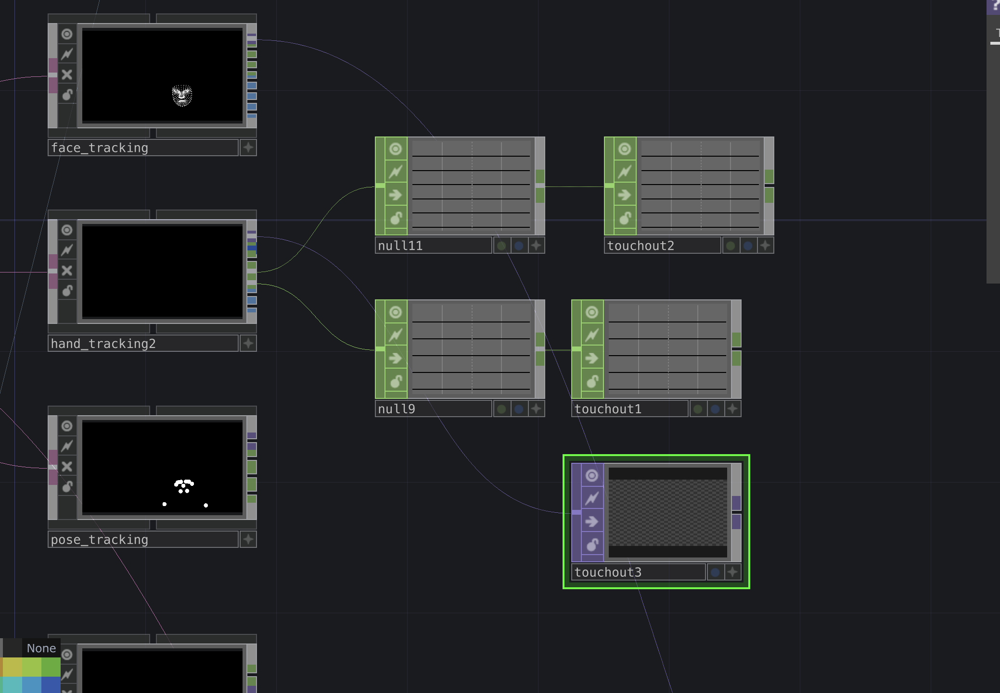
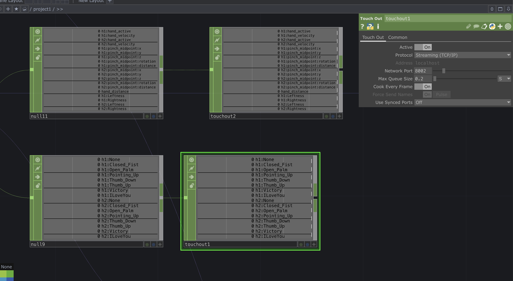
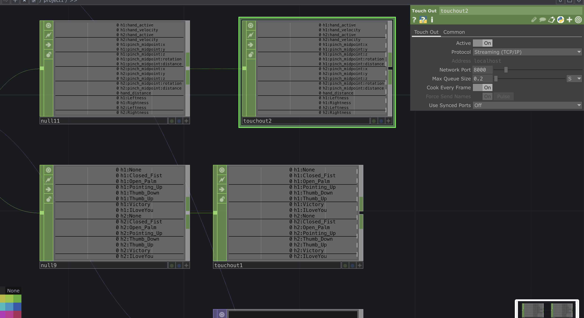

# Class Announcement

Hi everyone, thank you for the last session. And Happy New Year!

## Next Session
**Date & Time:** 09.01 at 10:00  
**Location:** Online  
**Link:** https://bbb.hfg-karlsruhe.de/b/hel-m6x-p07-j5z

## Todos till next session

Pick one or two elements in your sketch and control them via hand tracking. 
Use Math Chop, Trigger Chop or  any other to map the incoming Media Pipe to a parameter of your liking in your own sketch.

**Example Notes:**

You can use a Touch Out to send data across two patches. Make sure that your port numbers are the same in the Touch Out in the MediaPipe patch and the Touch In in the sketch patch.

### Example Setup from Last Class
Here are some reference images showing how to structure your hand tracking patches:

[Download the project file from class: Third_class.toe](Third_class.toe)

[Download MediaPipe file: release 3 folder](release%203/)

## Next Steps

In the next session, we will look at your files and explore how to trigger state transitions. For example, we'll see how to move from a still image to a MediaPipe-triggered version. We'll also look into using timers to create scenes and manage state changes.

